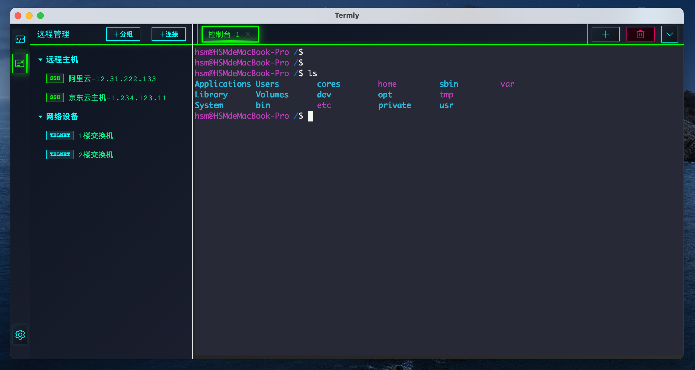
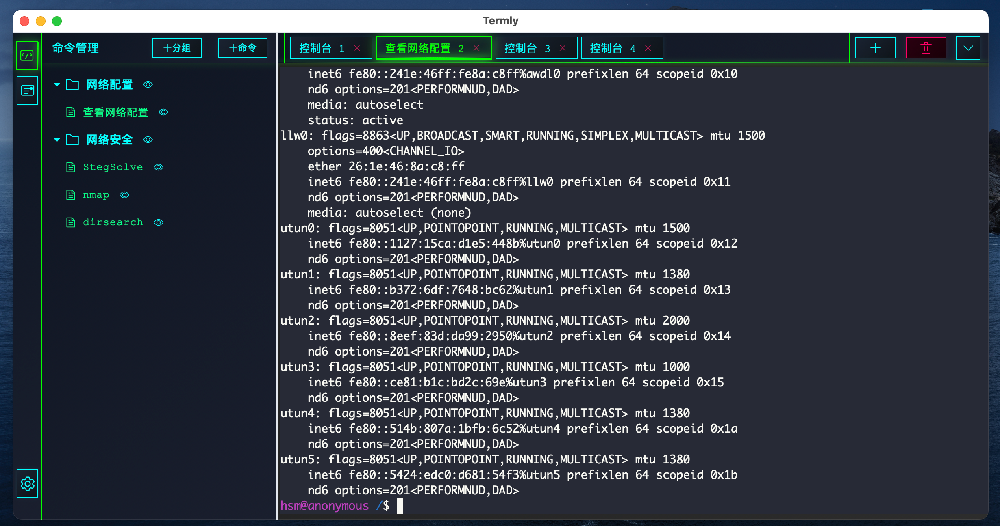
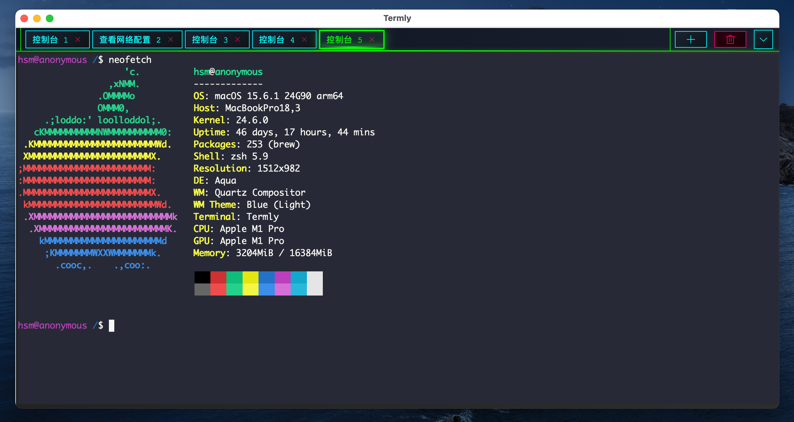
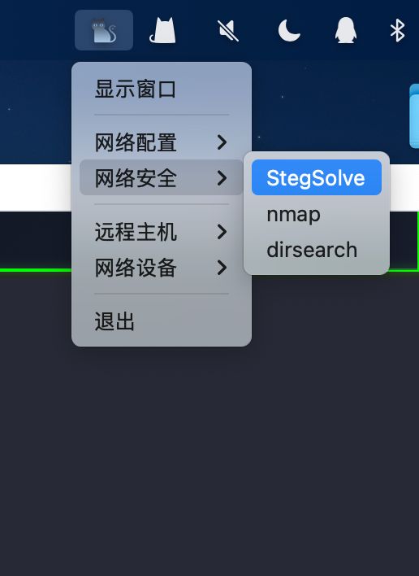
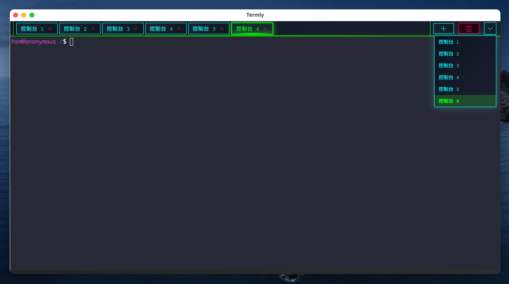

# Termly

Termly 是一款为开发者、运维工程师及远程设备管理者打造的 终端一体化工具，核心解决 “本地命令高效管理” 与 “SSH/Telnet 远程连接集中管控” 的双重需求，让终端操作从 “分散繁琐” 转向 “简洁高效”。

目前已编译Macos M1系统安装包，其他系统正在开发测试中。

## 已实现功能

- [x] **命令行管理**：支持常用命令的分类存储与快速调用，配置文件路径：`~/.Termly/commands.json`  
- [x] **SSH/Telnet 远程连接管理**：集中管理远程设备连接配置（含认证信息、端口等），配置文件路径：`~/.Termly/remote_connections.json`  
- [x] **完整终端功能**：提供本地终端环境，支持命令输入、输出展示及交互操作  
- [x] **系统托盘快捷访问**：在系统托盘展示常用命令快捷方式，点击即可快速执行，减少操作路径  
- [x] **快捷键全局控制**：通过自定义快捷键实现控制台切换、重置、新增等操作，提升操作效率  
- [x] **终端配置管理**：通过自定义修改终端参数，实现终端字体、主题、保留行数等配置。

## 快捷键 
-   Command + O 折叠菜单栏
-   Command + 左右方向键 切换控制台
- Command + D 删除当前控制台
- Command + R 重置当前控制台
- Command + N 新增控制台

